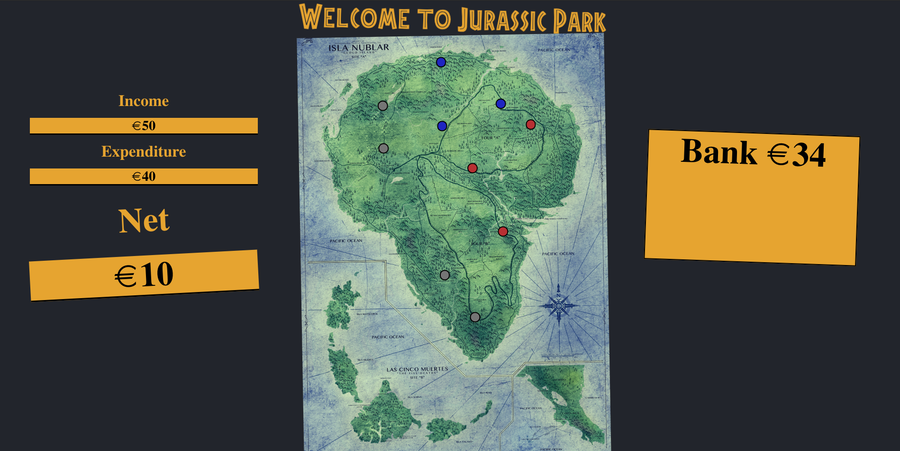

# Jurassic Park Management Game

This project is an interactive Jurassic Park themed park management game, where the user needs to balance buying new paddocks
and dinosaurs with the upkeep costs of buying paddocks. If a dinosaurs food level reaches zero then it dies and the user loses
the game. Alternatively if the users balance drops to zero, the user loses and if the balance reaches 100, the user wins.

This is a basic game, built in 6 days, that helped the group consolidate thier knowledge of Javascrips, React.JS and Java 
with PostreSQL.



### Installing and Running the code

Step by step instructions to get a development env running

To install all npm run the following code in both the server and the client folders:

```
npm install
```

Set up a PostgreSQL data with the following command:

```
createdb jurassic_park
```

Set up the backend:

```
Run the JurassicParkApplication file in a Java IDE (We used IntelliJ)
```

To start the run of the front-end, type the following while in the client folder:

```
npm start
```

Once everything is running the app will be accessible on localhost:8080. Enjoy the game and have some fun.
